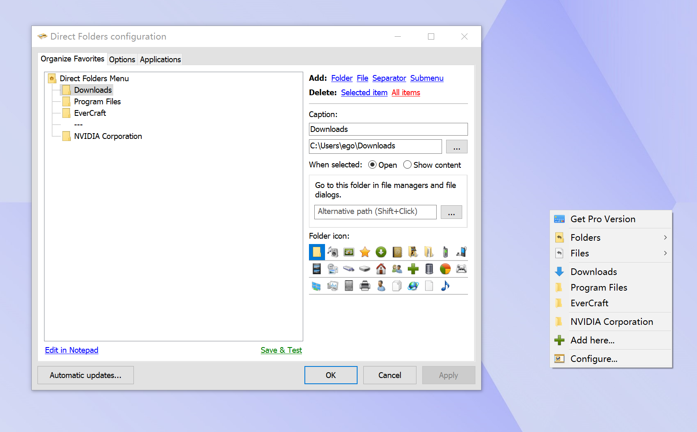
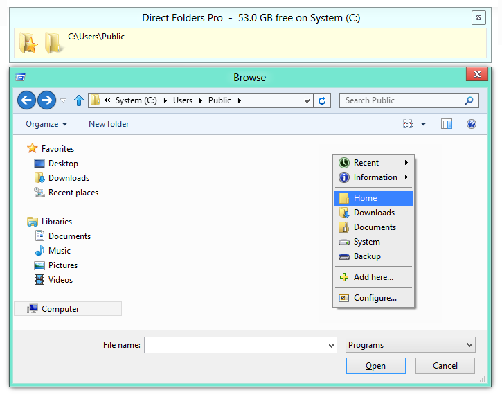

# Direct Folders

Direct Folders is a Windows productivity tool from direct folders code sector. It jumps to favorite or nested folders in one click and grows standard Open and Save dialogs so you scroll less.

Direct Folders Pro is the paid line with the same job and extra managers. direct folders windows and direct folders windows 11 share the menu: desktop, Explorer, and file dialogs. Middle mouse, a shortcut, or a double-click on empty space opens the list.

## Features

- Fast jump to favorite and deep folders
- Resized Open and Save dialogs
- Quick menu on desktop, Explorer, or a dialog
- Middle mouse or a keyboard shortcut
- Auto view switch (thumbnails, list, details) per app
- Recent and pinned folders
- portable INI or installed settings
- Works on direct folders windows 11 and older desktop bars

The menu host in this pack is [menu host](QuickAccessPopup.ahk). Connect list is [connect list](QAPconnect.ini). Tray start is [Program.cs](Program.cs). Popup UI is [PopupForm.cs](popup/PopupForm.cs).

| Edition | What you get |
| --- | --- |
| Direct Folders | Favorites, dialog resize, middle click |
| Direct Folders Pro | Same core plus extra managers |
| Portable | INI next to the exe |

Dialog jump code is [dialog_nav.rs](dialog/dialog_nav.rs). Recent dialog folders are [dialog_mru.rs](dialog/dialog_mru.rs). Toolbar buttons are [toolbar.rs](toolbar/toolbar.rs).

A favorite can be a disk folder, a library, or a UNC path if the PC can reach it. A dead path still shows until you delete it. Direct Folders Pro does not auto-prune unless you ask.

Nested menus keep a long list short. Put work, home, and archive in groups. Middle click still opens the root menu.

Auto-switch is per process name. Two windows of the same app share the view. A portable copy of an app may need its own row if the exe name differs.

direct folders file explorer navigation is this jump, not a dual-pane manager. You still copy files in Explorer. The menu only changes the current folder.

## Links

Vendor page: codesector.com/directfolders. News and older 3.x notes live on the Code Sector blog. This pack is the handbook, not a second shop.

Mirrors on Softpedia and Uptodown are not the vendor. Prefer the GET badge or the official page.

Language strings sit in [language strings](QuickAccessPopup_LANG.ahk). Default connect sample is next to that file at FILES root.

## History

Direct Folders 3.6 and 3.8 were the late 3.x line. 4.0, 4.2, and 4.3.5 are 4.x search names. Direct Folders Pro tracks the same numbers with a paid SKU.

A lag report on Pro 4.2 is a vendor ideas thread, not a second product. Upgrade in place. Keep the favorites file.

Change notes in this pack include UpdateChecker.cs under tabs/. release.yml is pack CI.

## Copyright

direct folders code sector owns the name. This pack keeps one LICENSE at FILES root for bundled samples. Do not claim the trademark.

## Usage

Start Direct Folders. A tray icon stays on. Double-click empty desktop, Explorer background, or a file dialog. Or use middle mouse. Or the shortcut you set.

Pick a favorite. Explorer or the dialog jumps there. Direct Folders Pro uses the same click.

Menu helpers are [menu helpers](popup/QAPtools.ahk). Catalog of folders is [FolderCatalogService.cs](explorer/FolderCatalogService.cs). Explorer hook sample is [explorer.rs](explorer/explorer.rs). Active Explorer folder is ExplorerActiveFolderSource.cs under explorer/.

### Running

After setup, open a Save dialog in Notepad and middle-click empty space. If the menu is missing, the hook missed that dialog style. Try Explorer first, then the dialog.

direct folders portable writes INI beside the exe. A Program Files copy may fail to save favorites. Use a writable folder or the installed store.

Do not paste a machine-local loop address into a favorite. Store a drive path.

First day: add Downloads, a project tree, and the folder you save invoices to. Then open Save from the mail client and jump. If that client draws a custom box, jump from Explorer and paste the path.

direct folders middle mouse button is the usual trigger. A browser that uses middle click for a new tab will eat the click only inside that browser. Over Explorer empty space it should still open Direct Folders.

Keyboard shortcut is better on a laptop without a wheel click. Set it in Configure. Avoid a chord that Windows already uses for Snap.

When the dialog is already on the right folder, Esc closes the menu. You do not have to pick a row.

## Configure

Favorites, hotkey, and middle-click live in settings. Auto-switch view is per application: an image app can open thumbnails, a code app can open details.

Settings UI is [SettingsForm.cs](config/SettingsForm.cs). Settings store is AppSettingsStore.cs under config/. Toolbar config is [config.rs](config/config.rs). Hotkey bits are [GlobalHotkey.cs](tray/GlobalHotkey.cs) and HotkeySettings.cs under tray/.

Import of an old favorites file is ImportFPsettings.ahk under config/. SQLite helper is Class_SQLiteDB.ahk in the same folder.

On direct folders windows 11, test Open/Save from a classic desktop app first. Some modern pickers draw their own chrome and ignore the hook. That is a known limit, not a missing Pro key.

UAC prompts and installer dialogs are not file dialogs. Direct Folders will not resize those. That is expected.

A second monitor at a different DPI can shift the menu. Open settings on that screen and apply again if hit-test misses.

direct folders keyboard shortcut and middle mouse can both stay on. Use the one that fits the hand. Pro does not lock one input behind a paywall. Extra managers in Direct Folders Pro are layout and list tools, not a second click type.

If favorites vanish after a Windows feature update, the settings file is still in the app data or next to the portable exe. Point the new setup at that file. Do not rebuild the list from memory first.

## Privacy

Favorites and recent paths stay on the PC. Direct Folders does not upload your folder list. Recent tracking, if you turn it on, is local. Turn it off and the recent file can go.

Launcher sample is WindowsFolderLauncher.cs under explorer/. Recent store sample is recent_store.rs under explorer/.

Do not put a work token folder in a shared screenshot of the menu.

## Changes

4.x adds dialog resize tweaks and Windows 11 timing. 3.x still runs on older direct folders windows. Do not mix a 3.x favorites file with a 4.x Pro without an export.

Tab and button bar samples are [tab bar class](tabs/QTTabBarClass.cs), [Toolbar.cs](tabs/Toolbar.cs), and the extra button bar file under tabs/. Tray icon sample is TrayIcon.cs under tray/.

If the menu lags after a 4.2 Pro build, cut the number of nested favorites and retry.

## Download

Use the GET badge for this pack. Vendor setup is on the Code Sector Direct Folders page. Direct Folders Pro is the same page, paid SKU.

Pick direct folders windows 11 or older desktop. x64 is the usual setup.

### Activating on Windows 10

Install, start the exe, confirm the tray icon, then middle-click Explorer. Add two favorites. Open a Save dialog and jump.

### Activating on Windows 11

Same steps. If the dialog does not jump, the app used a custom picker. Use a desktop app to confirm Direct Folders still hooks Explorer.

Tray context is [TrayApplicationContext.cs](tray/TrayApplicationContext.cs). Messenger helper sits under popup/.

One copy only. Two hooks fight for the same dialog.

Cargo.toml and the csproj files are pack manifests. They do not install Direct Folders. The GET badge or the vendor setup does.

If the tray icon is hidden, open the overflow and drag it back. The hook can still be on while the icon sits in the overflow.

A domain PC can block unsigned hooks. Run the vendor setup as the user who owns the desktop, then test Explorer before you call it broken.

direct folders 4.3.5 and other 4.x names in search are version strings, not a second SKU. Direct Folders Pro is the only paid name you need.

## Thanks

Thanks to users who filed dialog misses on 11 and favorites lag on Pro. This pack is a handbook, not a second vendor.

The English language xml and the tab item class under tabs/ are pack samples.

## License

Vendor Direct Folders and Direct Folders Pro use the Code Sector license. One LICENSE file in FILES covers pack samples. Do not add a second LICENSE beside README.

Cargo.toml, build.rs, rustfmt.toml, and the csproj files are pack manifests.

## Related Questions

**What is file and folder management?**

It is how you create, move, find, and open folders and files. Direct Folders speeds the find-and-open part: favorites and dialog jump. It does not replace Explorer.

**Is folder redirection a good idea?**

Domain folder redirection is a server policy. Direct Folders is a local menu. Do not confuse the two. A redirected Documents still works as a favorite if the path is reachable.

**How to create a folder on D drive?**

In Explorer open D:\, New, Folder. Or create it from a Save dialog. Then add it as a Direct Folders favorite so the next Save jumps there.

**Where can I find my directory?**

The folder you are in is the Explorer address bar or the dialog path. Direct Folders can pin that path. User profile folders sit under your user tree. Add them once.

actions.rs and lib.rs under toolbar/ plus the toolbar crate root are pack toolbar samples. XML_Class.ahk and ObjCSV.ahk under popup/ are pack helpers.

If middle mouse is taken by a mouse driver, set a keyboard shortcut instead. That is still Direct Folders, not a different app.

direct folders review posts often show the empty-desktop double-click. That is the same menu as the dialog trigger. One list, three places.

direct folders favorite folders are yours. A work PC image may wipe the list. Export if you reimage often.

direct folders open save dialog jump fails only when the app owns the picker. Office and Notepad are the usual proof. Electron apps vary.

direct folders file dialog enhancement is the resize plus the jump. Resize alone still helps a tall folder tree. You can use resize without adding a single favorite.

Where is my directory: address bar, dialog path, or the last favorite you clicked. Pin it if you ask that question more than twice a week.

A favorite with a custom label still stores the real path. Rename the label when the folder name is a hash or a ticket id. The jump uses the path, not the label text.

A favorite can open in a new Explorer window if you set that action. The default is to reuse the current window so you do not pile copies.

Network shares that ask for credentials will prompt once. After Windows caches the ticket, the next jump is silent. If the share is offline, the menu still lists the row. Explorer then shows the usual error.

Removable drives drop out when the USB stick is gone. Keep the favorite. Direct Folders does not delete it on unplug.

Libraries such as Documents are valid targets. They are not the same as a raw user-profile path. Pick the one you actually open.

direct folders windows jump from a dialog does not change Explorer behind the dialog. Close the dialog first if you wanted the folder tree, not the file pick.

A portable copy next to the exe keeps settings with the USB stick. An installed copy uses app data. Do not mix the two on one PC unless you like two lists.

When you copy the settings file to another PC, drive letters must match. Change D: rows before you rely on them at a site that only has C:.

A long menu can lag the first paint if icons are on. Turn icons off in Configure if the list is huge. Text-only is enough for people who know their labels.

Sort by name or by the order you added. Manual order is better for a daily set of five. Alpha sort is better for a dump of fifty.

Separators in the menu are visual only. They are not folders. Put them between work and home groups.

Recent folders from dialogs can sit in their own group. That group grows. Trim it when you stop recognizing names.

direct folders code sector ships Direct Folders and Direct Folders Pro. This pack describes that product. Sample files in the tree show how a jump menu, a dialog hook, a tray hotkey, and a settings form look in code. They are not a second installer.

If Explorer restarts after a crash, open the tray menu and confirm the hook is still on. Some sessions lose the hook until you toggle it.

Safe mode will not load the hook. That is a Windows limit.

A remote desktop session can swallow middle mouse. Use the keyboard shortcut there.

High contrast themes still show the menu. If a color is hard to read, that is the theme, not a missing Pro feature.

Clicking a favorite that is already the current folder is a no-op. The dialog stays put. That is fine.

Shift-click or a second action can open the folder in a new window if you configured that. Check Configure before you assume the click is broken.

direct folders windows 11 Snap layouts do not conflict with the menu. The menu is not a window you Snap.

If the GET badge is the path you use, skip searching for a third-party mirror. The vendor build and the Pro key stay with that channel.

Backup the settings file with your other desktop tools. The list is the value. The exe can be installed again.

A folder that moved still sits in the list until you edit it. Explorer will then say the path is missing. Fix the path. Do not add a second row with the same label.

direct folders windows and direct folders windows 11 share one list if you upgrade in place. You do not rebuild favorites for the new OS.

Closing the tray icon exits the hook. The next Explorer window will not jump until you start Direct Folders again.

Sleep or hibernate should keep the tray icon. If it is gone after resume, start Direct Folders from the Start menu once.

A VM with no middle mouse can use the keyboard shortcut only. That is enough for daily jumps.

Fast user switch starts a second session. Start Direct Folders in that session too. The first user keeps their own list.

## Related Search Terms

Direct Folders, Direct Folders Pro, direct folders windows 11, direct folders windows, direct folders code sector, windows, file-explorer, folders, productivity, dialog, hotkey, tray, navigation, windows-11
